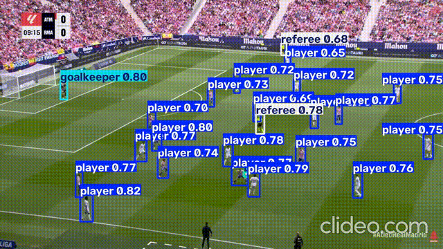

# Football-Computer-Vision
Football computer vision project aimed to analyze players performance through a YOLO, Triplets, etc.

# Model
For football object detection I ended up choosing Yolov11n due to hardware limitations (Nvidia GTX 1660 SUPER, 6 GB VRAM).

# Datasets
The YOLO model will be fine-tuned with SoccerNet's gamestate-2024 datasets, it has player, refeere, goalkeeper and ball as classes and over 70GBs worth of football recordings.
I ended up using these images to augmentate other Roboflow's datasets.

# Preprocess
I made a subsample of Soccernet's gamestate-2024 dataset by frame striding the original recordings. This decreases the image number from 42000 to 8000, reducing redundancy between consecutive frames, trading some training diversity for feasible training time on limited hardware.

# Training
Training is being done via Kaggle with different configurations, YOLO11 models and datasets.

# Object detection demo

# Documents of interest
Ball tracking: https://blog.roboflow.com/tracking-ball-sports-computer-vision/

# Libraries
Ultralytics: Provides YOLO architectures that I'll fine-tune for football object identification.

SoccerNet: Downloading SoccerNet's datasets for fine-tuning the YOLO model.

Supervision: Roboflow's library aimed to visualize our models predictions (box and classes displayings).

Albumentations: Image transformations to generate more training samples and do data augmentation, Ultralytics uses it natively while training.

PyTorch and Torchvision: Deep learning stuff and transfer learning.

OpenCV: Image handling.

XGBoost: Gradient Boosting models for analyzing player's performance.

python-dotenv: Enviroment variables handling.

